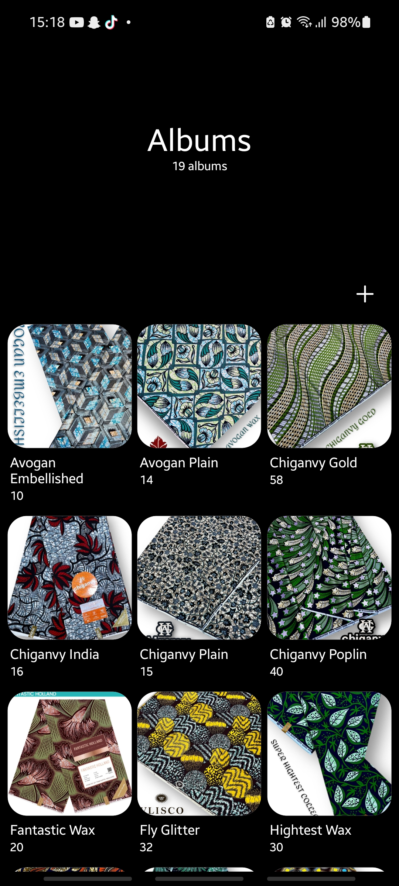
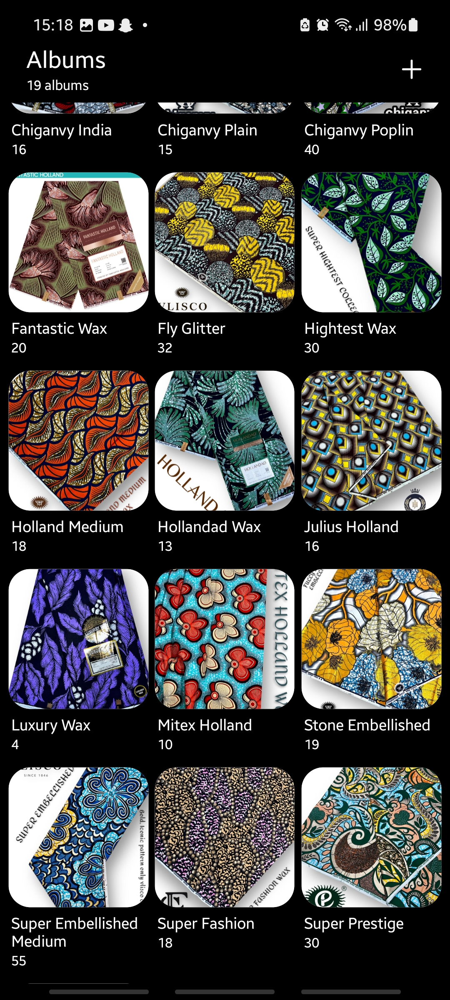
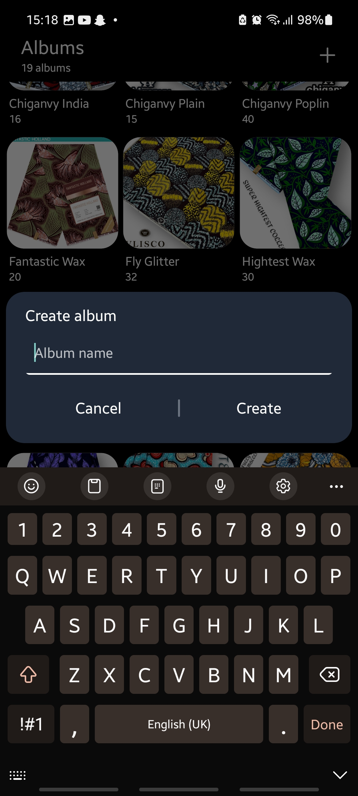
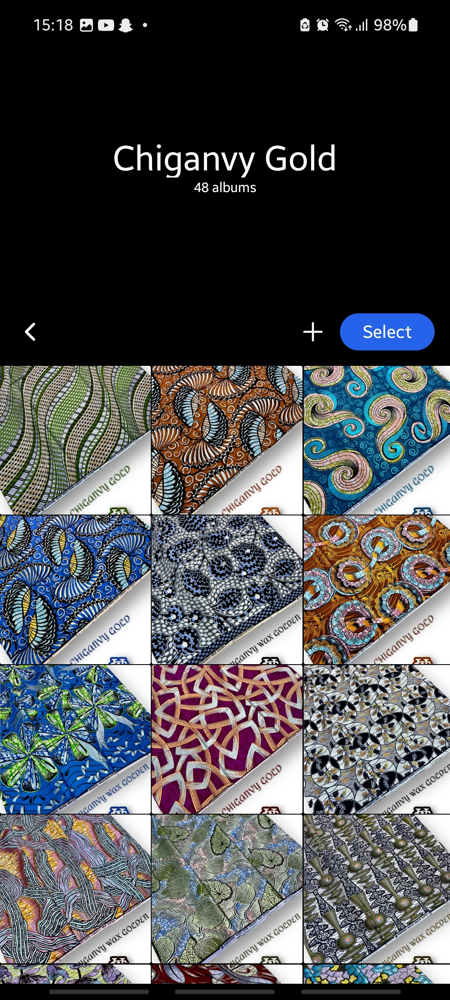
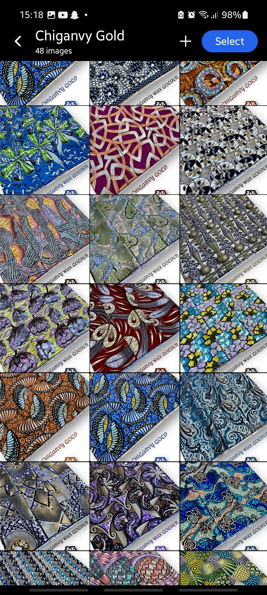
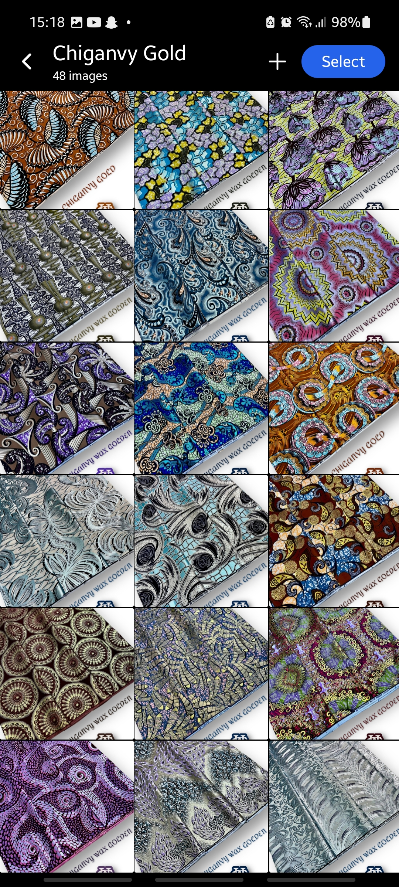
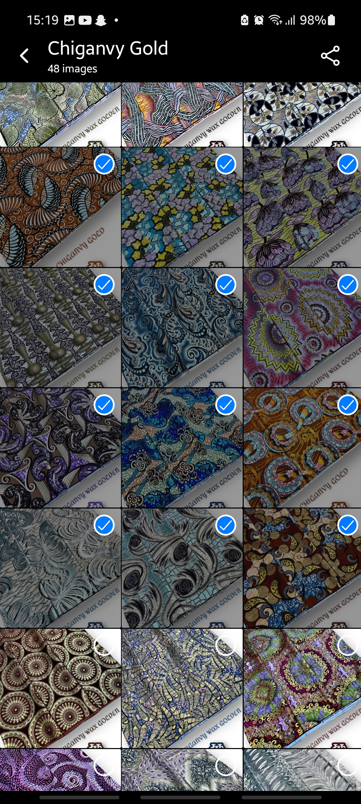

# Tahir Gallery

**Tahir Gallery** is a production-ready React Native **textile gallery** application built with **Expo** and **Supabase Storage**. It is not a generic photo gallery — it is specifically designed for showcasing **textile fabrics** (e.g. wax prints) organized into **albums/collections**.

Images are downloaded from Supabase Storage and cached locally on the device, enabling fast access and offline-friendly usage after the initial setup.

This README is written for **developers** who want to run, test, or extend the application correctly.

---

## 🚀 Quick Start (TL;DR)

```bash
git clone <repository-url>
cd tahir-gallery
npm install
expo start --dev-client
```

Before running the app, you **must**:

1. Create a Supabase project
2. Create a storage bucket named `gallery`
3. Organize images into album folders
4. Configure Supabase credentials in the app

Without these steps, the app will not function.

---

## Tech Stack

* **React Native** (Expo)
* **Expo Dev Client** (required)
* **Supabase** (Storage only)
* **TypeScript** (if enabled)
* **Expo FileSystem** (local asset storage)

---

## Prerequisites

Make sure you have the following installed:

* **Node.js** (LTS recommended)
* **npm** or **yarn**
* **Expo CLI**
* **Expo Go** app on your mobile device
* A **Supabase account**

Install Expo CLI if needed:

```bash
npm install -g expo-cli
```

---

## Project Setup

### 1. Clone the Repository

```bash
git clone <repository-url>
cd tahir-gallery
```

### 2. Install Dependencies

```bash
npm install
# or
yarn install
```

---

## Supabase Setup (MANDATORY)

⚠️ The app depends entirely on Supabase Storage. If this is not configured correctly, the app will fail.

### 1. Create a Supabase Project

* Visit [https://supabase.com](https://supabase.com)
* Create a new project
* Copy the following values:

  * **Project URL**
  * **Anon Public Key**

---

### 2. Create a Storage Bucket

* Open your Supabase dashboard
* Navigate to **Storage → Buckets**
* Create a bucket (example: `tahir-gallery`)

Recommended settings:

* **Public bucket** (simpler setup for gallery apps)

---

### 3. Upload Gallery Assets

Upload all images/media files that the app should display.

Example structure:

```
gallery/
 ├── super-wax/
 │   ├── wax_001.jpg
 │   ├── wax_002.jpg
 │   └── wax_003.jpg
 ├── ankara/
 │   ├── ankara_01.jpg
 │   └── ankara_02.jpg
 └── lace/
     ├── lace_01.jpg
     └── lace_02.jpg
```

Each folder represents a **textile album/collection**.

tahir-gallery/
└── images/
├── gallery1.jpg
├── gallery2.jpg
└── gallery3.png

```
tahir-gallery/
 ├── images/
 │   ├── gallery1.jpg
 │   ├── gallery2.jpg
 └── videos/
     └── intro.mp4
```

⚠️ File paths and names must match what the app expects.

---

## Environment Configuration

The project uses environment variables for Supabase credentials.

### `.env.example`

A `.env.example` file is included in the repository. Copy it and rename it to `.env`:

```bash
cp .env.example .env
```

Example contents:

```env
EXPO_PUBLIC_SUPABASE_URL=https://your-project-id.supabase.co
EXPO_PUBLIC_SUPABASE_ANON_KEY=your-anon-public-key
EXPO_PUBLIC_SUPABASE_BUCKET=tahir-gallery
```

⚠️ Never commit your real `.env` file.

---

## Running the App

### Start the Expo Dev Server

```bash
expo start
```

### Run on Device

* Open your **custom Expo Dev Client** on your phone
* Scan the QR code

The app will connect to Supabase and download textile images.

---

## App Lifecycle & Workflow

Understanding this flow is critical:

1. App launches via **Expo Dev Client**
2. App connects to Supabase Storage bucket (`gallery`)
3. Album folders are discovered dynamically
4. Images inside each album are fetched
5. Images are downloaded and cached locally
6. Textile gallery becomes fully usable (offline-friendly)

⚠️ Initial run **requires internet access**

---

## Local File Storage

* Assets are saved in the device’s file system
* Files persist between app restarts
* Improves performance and reduces bandwidth usage

---

## Common Problems & Fixes

### ❌ Supabase Connection Error

* Check `SUPABASE_URL` and `SUPABASE_ANON_KEY`
* Ensure the project is active

### ❌ Files Not Downloading

* Verify bucket name
* Confirm file paths
* Check bucket permissions

### ❌ Expo App Won’t Load

Clear cache:

```bash
expo start -c
```

---

## Development Notes

* Bucket structure should remain stable
* Renaming or moving files in Supabase may break downloads
* This app assumes Supabase as the single source of truth

---

## Screenshots

Screenshots of the application UI are included in the repository to help developers quickly understand the layout, design, and gallery behavior.

> 📸 See the `/screenshots` directory in the repository.









---

## Suggested Improvements

* Offline-first UX indicators
* Asset versioning / checksum validation
* Admin upload dashboard
* Lazy loading for large galleries

---

## Open Source License

This project is **open-source** and available for public use, modification, and learning.

A proper license file (MIT recommended) should be included in the repository.

---

## Author

**BB Gallery**
Built with Expo & Supabase

